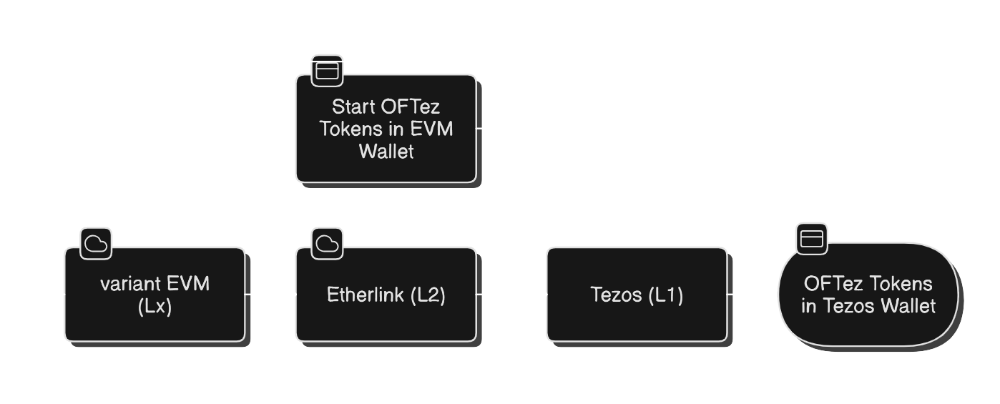
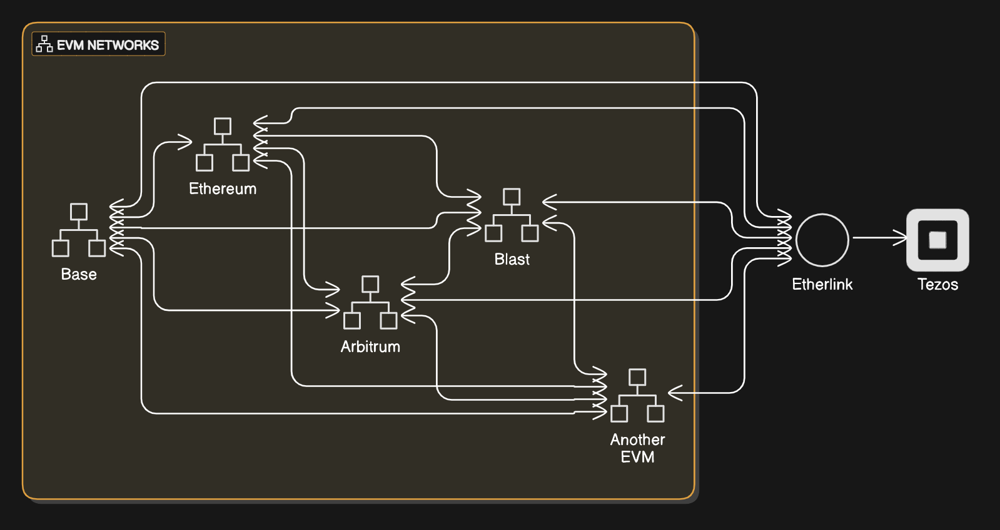

# Etherlink OFTez Token Bridge
The Etherlink OFTez Token Bridge provides an implementation of the [OFTez Bridging Standard](https://gitlab.com/taurai.ushewokunze/tzip/-/blob/master/drafts/current/draft-oftez-token-standard.md?ref_type=heads) 

## Introduction 
The Etherlink OFTez Token Bridge provides a way for EVM compatible tokens to bridge between hosting i.e. variant EVMs, Etherlink (L2) and Tezos (L1) without the need for token swaps along the way. Users simply bridge from their host EVM onto Etherlink using the same wallet address, proceeding to bridge from Etherlink onto Tezos (L1) to their preferred Tezos Wallet. This is shown below:


Additionally as OFTez Tokens can be implemented as a "mesh" between variant EVMs such as Base, Ethereum, Aribtrum etc, users can bridge point to point from whatever variant EVM they are on to Etherlink and onwards onto Tezos. This is shown below: 



## Tooling 

The tooling in this repository has been created to help you bridge tokens between OFTez Tokens on variant EVMs, Etherlink (L2) and Tezos (L1). You should be able to use them to establishng bridging for any Layer Zero OFT (on EVM) and any Tezos FA (1.2/2.0) compliant token. For further information on the OFT Token standard see [Layer Zero OFT](https://docs.layerzero.network/v2/developers/evm/oft/quickstart) and for further information on Tezos FA token standards see [Token standards](https://docs.tezos.com/architecture/tokens#token-standards)   

The tools will help you to submit bridging transactions both into Etherlink from either a variant EVM (crediting) or Tezos (L1) (depositing) as well as out of Etherlink i.e. from Etherlink to Tezos (L1) (withdrawing) or to a variant EVM (debiting).  

The tooling supports interaction with both Testnet and Mainnet. A list of supported variant EVMs is appended. 

## Prerequisites

To bridge tokens in this way, you need:

- An OFTezEVMProxy smart contract deployed on a variant EVM of your choice e.g. Base, Ethereum, Arbitrum
- An EVM-compatible wallet with enough native gas token on your variant EVM to pay for transaction fees. e.g. [Rabby Wallet](https://rabby.io/)
- An OFTezProxy smart contract deployed on Etherlink 
- An EVM-compatible wallet with enough XTZ on Etherlink to pay for transaction fees. e.g. [Rabby Wallet](https://rabby.io/)
- An FA-compliant smart contract deployed to Tezos.
 (You can use your own contract or the tool can deploy a sample contract for you.)
- A Tezos wallet with enough tez to pay for the Tezos transaction fees.
See [Installing and funding a wallet](https://docs.tezos.com/developing/wallet-setup) on docs.tezos.com.
If you are using a test network, you can find faucets that provide free tez at https://teztnets.com, such as the Ghostnet faucet at https://faucet.ghostnet.teztnets.com/.

See [Using your wallet](https://docs.etherlink.com/get-started/using-your-wallet) in the Etherlink documentation for a list of compatible wallets and information about connecting your wallet to Etherlink.
If you are using Etherlink Testnet, you can get free XTZ at the [Etherlink faucet](https://faucet.etherlink.com/).

## Contracts


- **OFTezEVMProxy**: This Etherlink contract mints and burns Layer Zero OFT compliant tokens that are equivalent to the Tezos tokens.
This contract implements the Layer Zero OFT internal credit and debit interface and enables tokens to be exchanged between:
* variant EVM &harr; variant EVM
* variant EVM &harr; Etherlink (L2)

For more information on the Layer Zero OFT standard see [here](https://docs.layerzero.network/v2/developers/evm/oft/quickstart) 
For an example, see ['OFTezEVMProxy.sol](etherlink/src/OFTezEVMProxy.sol)


- **OFTezProxy**: This Etherlink contract accepts the tickets and mints Layer Zero OFT compliant tokens that are equivalent to the Tezos tokens. This contract also mints/burns Layer Zero OFT compliant tokens bridged into/out of Etherlink 
This contract implements the TZIP029 [deposit interface](https://gitlab.com/baking-bad/tzip/-/blob/wip/029-etherlink-token-bridge/drafts/current/draft-etherlink-token-bridge/etherlink-token-bridge.md#l2-proxy-deposit-interface) and [withdraw interface](https://gitlab.com/baking-bad/tzip/-/blob/wip/029-etherlink-token-bridge/drafts/current/draft-etherlink-token-bridge/etherlink-token-bridge.md#l2-proxy-withdraw-interface).
For an example, see [`OFTezProxy.sol`](etherlink/src/OFTezProxy.sol).


The bridging process relies on smart contracts that convert tokens to [tickets](https://docs.tezos.com/smart-contracts/data-types/complex-data-types#tickets) and transfer the tickets between Tezos and Etherlink.
These contracts are an implementation of the [TZIP-029](https://gitlab.com/baking-bad/tzip/-/blob/wip/029-etherlink-token-bridge/drafts/current/draft-etherlink-token-bridge/etherlink-token-bridge.md) standard for bridging between Tezos and Etherlink.

For the OFTez tokens to be realised on Tezos a matching FA 1.2 or 2.0 standard token needs to be deployed on Tezos (L1). The contracts below also need to be implemented to support the bridging capability

- **Ticketer**: This Tezos contract stores FA1.2 and FA2.0 tokens and issues tickets that represent those tokens, similar to a wrapped token.
The ticket includes the type and number of tokens that it represents and the address of the ticketer contract.
For an example, see the [`ticketer.mligo`](tezos/contracts/ticketer/ticketer.mligo) contract.

- **Token bridge helper**: This Tezos contract accepts requests to bridge tokens, uses the ticketer contract to get tickets for them, and sends the tickets to Etherlink.
For an example, see [`token-bridge-helper.mligo`](tezos/contracts/token-bridge-helper/token-bridge-helper.mligo).


For information about how these contracts communicate with each other, see [bridge configuration](docs/README.md#bridge-configuration).

## Setup

Follow these steps to set up the tool for local use.
You can run the tool directly or build a Docker container that runs it.

### Local installation

1. Install [Poetry](https://python-poetry.org/) if it is not already installed by running this command:

   ```shell
   curl -sSL https://install.python-poetry.org | python3 -
   ```

2. Clone this repository and go into its directory.

3. Install the tool's dependencies by running this command:

   ```shell
   poetry install
   ```

4. Optional: Rebuild and test the contracts locally as described in [compilation and running tests](#compilation-and-running-tests).

Then you can run commands by running `poetry run` followed by the command name, such as `poetry run bridge_token`.

### Docker installation

1. Clone this repository and go into its directory.

2. Build the Docker image by running this command:

   ```bash
   docker build -t etherlink-bridge .
   ```

Now you can run commands by prefixing them with `docker run --rm etherlink-bridge`, such as `docker run --rm etherlink-bridge bridge_token`.

## Setting up bridging for a token

This tool's `bridge_token` command deploys the bridging contracts for a single token.
If you have multiple token types, as in FA2 multi-asset contracts, you must run this command once for each type of token to bridge.
The tool also has separate commands for deploying the contracts individually if you want to deploy the contracts one at a time.

Here is an example of the command to deploy the bridging contracts for an FA1.2 token:

```shell
poetry run bridge_token \
    --token-address KT1SekNYSaT3sWp55nhmratovWN4Mvfc6cfQ \
    --token-type FA1.2 \
    --token-id=0 \
    --token-decimals 0 \
    --token-symbol "TST12" \
    --token-name "Test FA1.2 Token" \
    --tezos-private-key ${TEZOS_WALLET_PRIVATE_KEY} \
    --tezos-rpc-url "https://rpc.ghostnet.teztnets.com" \
    --etherlink-private-key ${ETHERLINK_WALLET_PRIVATE_KEY} \
    --etherlink-rpc-url "https://node.ghostnet.etherlink.com" \
    --skip-confirm
```

Here is an example of the command to deploy the bridging contracts for an FA2 token:

```shell
poetry run bridge_token \
    --token-address KT19P1nbGzGnumMfRHcLNuyQUdcuwjpBfsCU \
    --token-type FA2 \
    --token-id=0 \
    --token-decimals 8 \
    --token-symbol "TST" \
    --token-name "TST Token" \
    --tezos-private-key ${TEZOS_WALLET_PRIVATE_KEY} \
    --tezos-rpc-url "https://rpc.ghostnet.teztnets.com" \
    --etherlink-private-key ${ETHERLINK_WALLET_PRIVATE_KEY} \
    --etherlink-rpc-url "https://node.ghostnet.etherlink.com" \
    --skip-confirm
```

The `bridge_token` command accepts these arguments:

- `--token-address`: The Tezos address of the token contract, starting with `KT1`
- `--token-type`: The token standard: `FA1.2` or `FA2`
- `--token-id`: The ID of the token to bridge; for FA1.2 contracts, which have only one token, use `0`
- `--token-decimals`: The number of decimal places used in the token quantity
- `--token-symbol`: An alphanumeric symbol for the token
- `--token-name`: A name for the token
- `--tezos-private-key`: The private key for the Tezos account
- `--tezos-rpc-url`: The URL to a Tezos RPC server to send the transactions to; for RPC servers on test networks, see https://teztnets.com
- `--etherlink-private-key`: The private key for the EVM-compatible wallet that is connected to Etherlink
- `--etherlink-rpc-url`: The URL to the Etherlink RPC server to send the transactions to; see [Network information](https://docs.etherlink.com/get-started/network-information) on docs.etherlink.com
- `--skip-confirm`: Skip the confirmation step; required if you are running the command via Docker

The output of the command includes the addresses of the contracts and the content of the ticket that they use for bridging.
Save this information for use in depositing and withdrawing tokens.

## Depositing tokens

After you have set up bridging for a token, you can bridge tokens from Tezos to Etherlink with the `deposit` command, as in this example:

```shell
poetry run deposit \
    --token-bridge-helper-address KT1KiiUkGKFqNAK2BoAGi2conhGoGwiXcMTR \
    --amount 77 \
    --tezos-private-key ${TEZOS_WALLET_PRIVATE_KEY} \
    --tezos-rpc-url "https://rpc.ghostnet.teztnets.com" \
    --receiver-address 0x7e6f6CCFe485a087F0F819eaBfDBfb1a49b97677 \
    --smart-rollup-address sr18wx6ezkeRjt1SZSeZ2UQzQN3Uc3YLMLqg
```

The `deposit` command takes these parameters:

- `--token-bridge-helper-address`: The address of the token bridge helper contract, from the output of the `bridge_token` command
- `--amount`: The amount of tokens to bridge
- `--tezos-private-key`: The private key for the Tezos account that is depositing the tokens
- `--tezos-rpc-url`: The URL to a Tezos RPC server to send the transactions to; for RPC servers on test networks, see https://teztnets.com
- `--receiver-address`: The Etherlink account address of the account to send the tokens to
- `--smart-rollup-address`: The address of the Etherlink Smart Rollup, which is `sr1Ghq66tYK9y3r8CC1Tf8i8m5nxh8nTvZEf` for Mainnet and `sr18wx6ezkeRjt1SZSeZ2UQzQN3Uc3YLMLqg` for Testnet

If the deposit transaction is successful, the command returns the hash of the transaction, which you can look up on a Tezos block explorer.

After the deposit transaction, the tokens are available immediately on Etherlink.
You can see the bridged tokens by looking up the ERC-20 proxy contract or your Etherlink account on the Etherlink block explorer.

## Withdrawing tokens

After you bridge tokens to Etherlink, you can withdraw them back to Tezos with the `withdraw` command, as in this example:

```shell
poetry run withdraw \
    --erc20-proxy-address 0x8AaBCd16bA3346649709e4Ff93E5c6Df18D8c2Ed \
    --amount 1 \
    --tezos-side-router-address KT199szFcgpAc46ZwsDykNBCa2t6u32xUyY7 \
    --ticketer-address-bytes 0x0106431674bc137dcfe537765838b1864759d6f79200 \
    --ticket-content-bytes 0x0707000005090a000000a505020000009f07040100000010636f6e74726163745f616464726573730a000000244b54313950316e62477a476e756d4d665248634c4e75795155646375776a70426673435507040100000008646563696d616c730a0000000138070401000000046e616d650a0000000a5465737420546f6b656e0704010000000673796d626f6c0a000000035453540704010000000a746f6b656e5f747970650a000000054641312e32 \
    --receiver-address tz1ekkzEN2LB1cpf7dCaonKt6x9KVd9YVydc \
    --etherlink-private-key ${ETHERLINK_WALLET_PRIVATE_KEY} \
    --etherlink-rpc-url "https://node.ghostnet.etherlink.com"
```

The `withdraw` command accepts these arguments:

- `--erc20-proxy-address`: The address of the ERC-20 proxy contract on Etherlink
- `--amount`: The amount of tokens to withdraw
- `--tezos-side-router-address`: The address of the ticketer contract on Tezos or a separate router contract if the token uses a router for bridging
- `--ticketer-address-bytes`: The address of the ticketer contract as a series of bytes, which you can get from the output of the `bridge_token` command or the `get_ticketer_command` command
- `--ticket-content-bytes`: The content of the ticket as a series of bytes, which you can get from the output of the `bridge_token` command or the `get_ticketer_command` command
- `--receiver-address`: The Tezos address of the account to send the tokens to
- `--etherlink-private-key`: The private key for the EVM-compatible wallet that is connected to Etherlink
- `--etherlink-rpc-url`: The URL to the Etherlink RPC server to send the transactions to; see [Network information](https://docs.etherlink.com/get-started/network-information) on docs.etherlink.com

The output of the command includes the hash of the Etherlink transaction that initiates the withdrawal.

The withdrawn tokens are not usable on Tezos until after the commitment with the withdrawal transaction is cemented, which takes two weeks.
After the commitment is cemented, you can run the transaction to release the tokens on Tezos.
See [Withdrawal process](docs/README.md#withdrawal-process).

## Compilation and Running Tests
1. Install Foundry by following the [installation guide](https://book.getfoundry.sh/getting-started/installation)
> [!NOTE]
> The version of `forge` used to build contracts is `forge 0.2.0 (41d4e54 2024-09-17T00:18:07.762487140Z)`.

2. Install LIGO with the instructions at https://ligolang.org.

3. Install Solidity dependencies with Forge (part of the Foundry toolchain). Installation should be executed from the `etherlink` directory:
```shell
(cd etherlink && forge install)
```

Forge uses [git submodules](https://git-scm.com/book/en/v2/Git-Tools-Submodules) to manage dependencies. It is possible to check versions of the Solidity libraries installed by running `git submodule status`. Here are the versions used to compile contracts:
```shell
1d9650e951204a0ddce9ff89c32f1997984cef4d etherlink/lib/forge-std (v1.6.1)
fd81a96f01cc42ef1c9a5399364968d0e07e9e90 etherlink/lib/openzeppelin-contracts (v4.9.3)
```

### Compilation
#### 1. Tezos side:
To compile Tezos-side contracts, the LIGO compiler must be installed. The most convenient method is to use the Docker version of the LIGO compiler. Compilation of all contracts using the dockerized LIGO compiler can be initiated with the following command:
```shell
poetry run build_tezos_contracts
```

> [!NOTE]
> This repository includes built Tezos side contracts which are located in the [tezos/build](tezos/build/) directory.

#### 2. Etherlink side:
To compile contracts on the Etherlink side, Foundry must be installed. To initiate the compilation, navigate to the [etherlink](etherlink/) directory and run `forge build`, or execute the following script from the root directory:
```shell
poetry run build_etherlink_contracts
```

> [!NOTE]
> This repository includes built Etherlink side contracts which are located in the [etherlink/build](etherlink/build/) directory.

### Tests
#### 1. Tezos side:
The testing stack for Tezos contracts is based on Python and requires [poetry](https://python-poetry.org/), [pytezos](https://pytezos.org/), and [pytest](https://docs.pytest.org/en/7.4.x/) to be installed.

To run tests for the Tezos contracts, execute:
```shell
poetry run pytest tezos/tests
```

#### 2. Etherlink side:
The Etherlink contract tests use the [Foundry](https://book.getfoundry.sh/getting-started/installation) stack and are implemented in Solidity. To run these tests, navigate to the [etherlink](etherlink/) directory and run `forge test`, or execute the following script from the root directory:
```shell
poetry run etherlink_tests
```

## Linting
To perform linting, execute the following commands:

```shell
poetry run mypy .
poetry run ruff .
poetry run black .
```

## Example commands

### Deploy bridge contracts for a token

```shell
docker run --rm etherlink-bridge bridge_token \
    --token-address KT19P1nbGzGnumMfRHcLNuyQUdcuwjpBfsCU \
    --token-type FA1.2 \
    --token-decimals 8 \
    --token-symbol "TST" \
    --token-name "Test Token" \
    --tezos-private-key edsk4XG4QyAj19dr78NNGH6dpXBtTnkmMdAkM9w5tUTCHaUP1pJaD5 \
    --tezos-rpc-url "https://rpc.tzkt.io/parisnet/" \
    --etherlink-private-key f463e320ed1bd1cd833e29efc383878f34abe6b596e5d163f51bb8581de6f8b8 \
    --etherlink-rpc-url "https://etherlink.dipdup.net" \
    --skip-confirm
```

### Bridge tokens from Tezos to Etherlink

```shell
docker run --rm etherlink-bridge deposit \
    --token-bridge-helper-address KT1KiiUkGKFqNAK2BoAGi2conhGoGwiXcMTR \
    --amount 77 \
    --receiver-address 0x7e6f6CCFe485a087F0F819eaBfDBfb1a49b97677 \
    --smart-rollup-address sr1HpyqJ662dWTY8GWffhHYgN2U26funbT1H \
    --tezos-private-key edsk4XG4QyAj19dr78NNGH6dpXBtTnkmMdAkM9w5tUTCHaUP1pJaD5 \
    --tezos-rpc-url "https://rpc.tzkt.io/parisnet/"
```

### Bridge tokens from Etherlink to Tezos

```shell
docker run --rm etherlink-bridge withdraw \
    --erc20-proxy-address 0x8AaBCd16bA3346649709e4Ff93E5c6Df18D8c2Ed \
    --amount 17 \
    --tezos-side-router-address KT199szFcgpAc46ZwsDykNBCa2t6u32xUyY7 \
    --ticketer-address-bytes 0x0106431674bc137dcfe537765838b1864759d6f79200 \
    --ticket-content-bytes 0x0707000005090a000000a505020000009f07040100000010636f6e74726163745f616464726573730a000000244b54313950316e62477a476e756d4d665248634c4e75795155646375776a70426673435507040100000008646563696d616c730a0000000138070401000000046e616d650a0000000a5465737420546f6b656e0704010000000673796d626f6c0a000000035453540704010000000a746f6b656e5f747970650a000000054641312e32 \
    --receiver-address tz1ekkzEN2LB1cpf7dCaonKt6x9KVd9YVydc \
    --etherlink-private-key f463e320ed1bd1cd833e29efc383878f34abe6b596e5d163f51bb8581de6f8b8 \
    --etherlink-rpc-url "https://etherlink.dipdup.net"
```


# Chain Support 
Below is a list of the chains that are supported by this tooling 

|Chain      | Type    |
|-----------|---------|
|Tezos      | Mainnet |
|Tezos      | Ghostnet| 
|Etherlink  | Mainnet | 
|Etherlink  | Ghostnet|
|Base       | Mainnet |
|Base       | Testnet | 
|Ethereum   | Mainnet | 
|Ethereum   | Testnet | 
|Arbitrum   | Mainnet | 
|Arbitrum   | Testnet | 